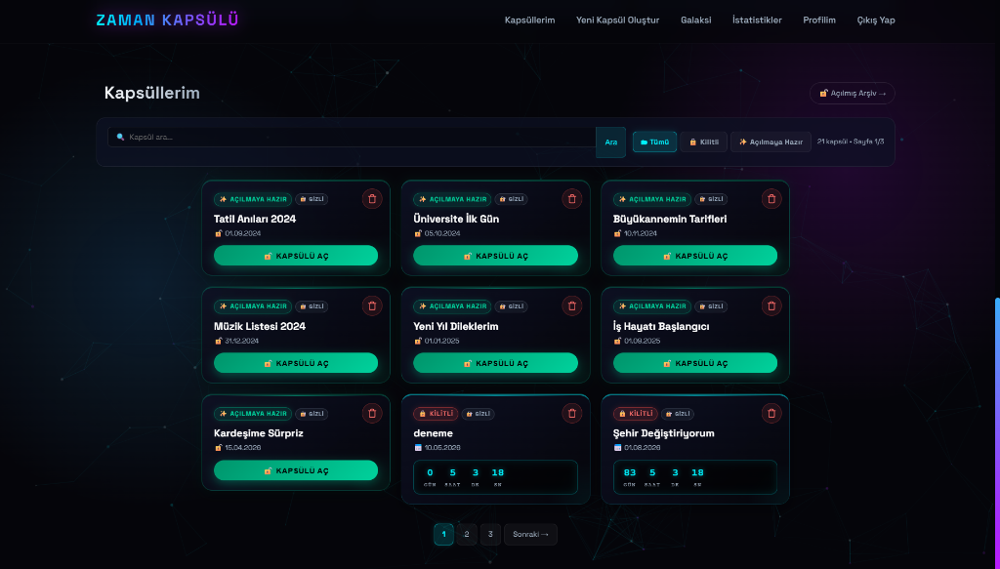
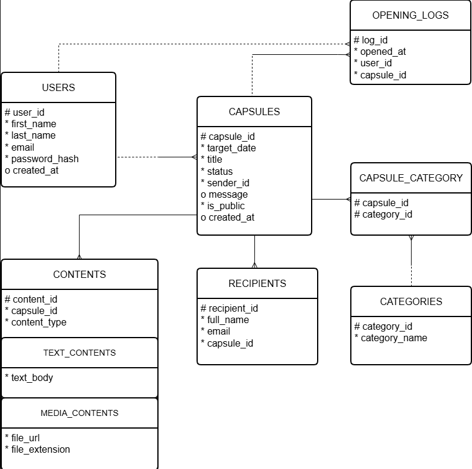

<div align="center">
  <h1>⏳ Digital Time Capsule</h1>
  <p><strong>A modern, cyberpunk-themed web application to send messages and media into the future.</strong></p>
  <p><em>Built as a Term Project for Database Systems (CPE210) & Internet-Based Programming (CPE212)</em></p>

  
</div>

---

## 🚀 About The Project
**Digital Time Capsule** allows users to write letters, attach media, and securely "lock" them until a specific date in the future. Once the target date arrives, the capsule unlocks, revealing its contents through an interactive animation.

The project features a sleek, dark-mode user interface with a robust, relational database architecture running behind the scenes.

## ✨ Features
* **Secure Authentication:** User registration and login powered by SHA-256 password hashing.
* **Capsule Management:** Create, list, search, and dynamically filter time capsules.
* **Auto-Unlock Mechanism:** Capsules automatically transition to 'Unlocked' status when the real-world date surpasses their target date.
* **AJAX Operations:** Instant, page-reload-free capsule deletion and animated content fetching.
* **Gamification & Statistics:** Users earn rank badges (Novice → Immortal Legend) based on capsule counts. A global leaderboard ("Galaxy") ranks the top users.
* **Dynamic Analytics:** Real-time Chart.js visual data representations of capsule categories.

## 🛠️ Technology Stack
* **Frontend:** HTML5, CSS3 (Custom Properties, Keyframes), JavaScript (ES6+, Fetch API), Chart.js
* **Backend:** PHP 8 (Session Management, Routing)
* **Database:** MySQL / MariaDB (PDO, Transaction Control)
* **Architecture:** 7-Entity Relational Database with Supertype/Subtype (Oracle Notation)

## 🗄️ Database Schema (ERD)
The backend is powered by a robust 7-entity relational schema featuring a supertype/subtype pattern (`CONTENTS` -> `TEXT_CONTENTS` / `MEDIA_CONTENTS`). 

<p align="center">
  
</p>

## ⚙️ Installation & Setup

1. **Clone the repository:**
   ```bash
   git clone https://github.com/erenyrlmz/Digital-Time-Capsule.git
   ```

2. **Configure Local Environment:**
   * Move the project folder into your local server's root directory (e.g., `C:\xampp\htdocs\zaman-kapsulu`).
   * Start Apache and MySQL via XAMPP/MAMP.

3. **Setup the Database:**
   * Open phpMyAdmin (`http://localhost/phpmyadmin`).
   * Create a new empty database named `zaman_kapsulu`.
   * Import the `database_backup.sql` file provided in the repository root.
   * *(Optional)* Import `sample_data.sql` to populate the database with demo users and 50+ generated capsules.

4. **Run the App:**
   * Visit `http://localhost/zaman-kapsulu/` in your browser.
   * **Demo Accounts:** Use emails like `ahmet@demo.com` with the password `123456` if you imported the sample data.

---

### 👨‍💻 Team Members
* **Abdullah Eren Yorulmaz** (2310205028)
* **Mahammadali Rasulzade** (2310205590)
* **Sait Yasir Başaran** (2310205040)

*Karabuk University - 2025/2026 Spring Semester*
